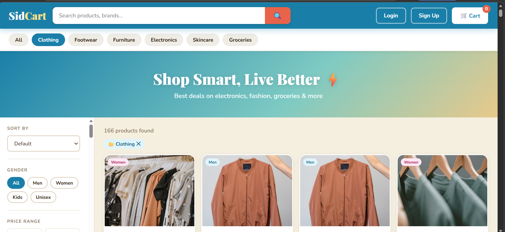

SidCart is a full-stack online shopping web application inspired by modern platforms like Blinkit and Flipkart, designed to provide a smooth and interactive shopping experience for both customers and administrators. The platform allows users to browse products by categories, search for items, create accounts, log in securely using Firebase Authentication, add products to their cart, and complete purchases using simulated payment methods such as cash or credit. Customers can also view their order history, making the system feel like a real-world e-commerce solution. The frontend is built using HTML, CSS, and JavaScript, while Firebase Firestore serves as the cloud database for managing products, categories, users, orders, and sales data.

On the administrative side, SidCart includes a dedicated dashboard that enables product inventory management through core CRUD operations such as adding, viewing, and deleting products. This project was developed as an educational e-commerce system to demonstrate practical implementation of API integration, authentication, cloud database usage, responsive UI design, and role-based access management. By combining customer and admin functionalities into one system, SidCart showcases a complete online shopping workflow while remaining scalable for future enhancements like payment gateways, advanced reporting, and real-time inventory control.

